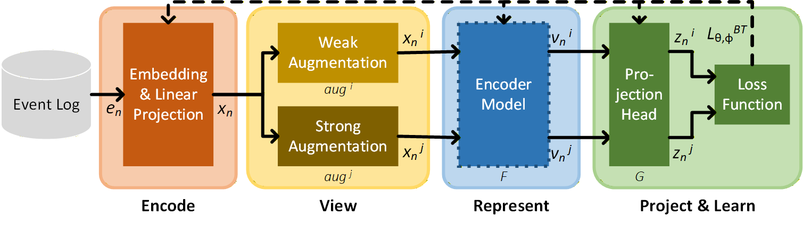

# When Does Pre-Training Pay Off? Architecture versus Self-Supervised Learning for Business Process Predictions
 

  
    
  <b>Figure 1.</b> Self-supervised framework for event representation learning.

 
This repository contains the implementation, preprocessing, and evaluation code for the paper *"When Does Pre-Training Pay Off? Architecture versus Self-Supervised Learning for Business Process Predictions."* It reproduces the controlled ablation that disentangles the contribution of self-supervised pre-training from the encoder's architectural inductive bias across five real-world ITSM event logs.
 

  
Abstract

  Organizations increasingly turn event log data into predictions that guide operational decisions, yet their quality depends on how events are repre-sented. Self-supervised pre-training learns repre-sentations on such structured data, but it is unclear whether gains stem from the training objective or the encoder's architectural inductive bias. We disentangle the two through a controlled ablation comparing Barlow Twins-trained transformer encoders against randomly initialized counterparts, with an ablation isolating the augmentation effect. Frozen embeddings feed LSTM and Transformer models for regression and classification across five real-world datasets. Pre-training rarely beats ran-dom initialization: on most logs the two are within run-to-run variation, and where it helps regression, the gain comes from mix-up and cut-mix augmentation, not the objective, while classification sees no pre-training benefit. The architecture accounts for much of the gain regardless of initialization; therefore, pre-training is best treated as a targeted investment for specific, regression-oriented decisions rather than a default step.

## Overview
 
We study *when* self-supervised pre-training improves event representations for predictive process monitoring (PPM), beyond what the encoder architecture already provides. Two transformer encoders — a *TabTransformer* (column-wise attention) and a *SetTransformer* (permutation-invariant aggregation) — are trained with the *Barlow Twins* objective to produce fixed-length event embeddings, and compared against identically-structured encoders that are *randomly initialized and frozen*. A further ablation removes the mix-up and cut-mix augmentations to separate the contribution of the training objective from the augmentation strategy.
 
The frozen embeddings are consumed by LSTM and Transformer downstream models for *remaining-time* (regression) and *next-activity* (classification) prediction.
 
**Key findings**
 
- Pre-training rarely beats random initialization; on most logs the two are within run-to-run variation.
- Where a regression benefit appears, it stems from the **augmentation strategy** (mix-up / cut-mix), not the Barlow Twins objective.
- The **encoder architecture** accounts for most of the representational quality regardless of initialization, with column-wise attention outperforming permutation-invariant aggregation on the larger logs.
- We recommend including a **random-initialization baseline** as a standard control when evaluating self-supervised representation learning in this setting.
## Repository Contents
 
### Notebooks
 
The `notebooks` folder contains the source code (runnable in Google Colab) alongside a requirements file:
 
- **01 – Preprocessing and Analysis** — data preprocessing pipeline, descriptive analysis of the event logs, and splitting/cleaning.
- **02 – Model Development** — implementation of the event representation learning framework, the LSTM and Transformer downstream models, and the training procedures and monitoring utilities.
- **03 – Model Comparison** — model evaluation, statistical comparison against the baselines, and performance visualization.
### Datasets
 
The `datasets` folder contains the compressed [TensorFlow Datasets](https://www.tensorflow.org/guide/data) used to train the representation-learning encoders (subfolder `tabular`) and the downstream models (subfolder `embedding`). For the datasets used by the sequential models please see [here](https://github.com/mchennig/tgn-ast).
 
### Embeddings
 
The `embeddings` folder contains the embeddings generated by the Set- and TabTransformer encoders, organized by event log. Embeddings are stored as compressed `npz` files with the keys:
 
- `train` — training-split embeddings
- `test` — test-split embeddings

Files are named after the encoder (`set` or `tab`). Additionally, we provide the the first embedding runs and relevant metadata as `tsv` files. These files can be loaded in [TensorFlow Embedding Projector](https://projector.tensorflow.org/) which allows comprehensive visualizations in the two- and three-dimensional space using different dimensionality reduction techniques including PCA, UMAP and t-SNE. The embeddings in the compatible fomat can be found [here](https://syncandshare.lrz.de/getlink/fiQBT66aDjD83Ttxhg6DE2).
 
### Results
 
The `results` folder contains the predictions of the trained models, organized by prediction task (next activity, remaining time) and event log. Files are compressed `npz` with the keys:
 
- `y_true` — ground-truth values (integer class indices for classification; floating-point values for regression; small deviations may occur due to floating-point precision).
- `y_pred` — model predictions from our training runs.
